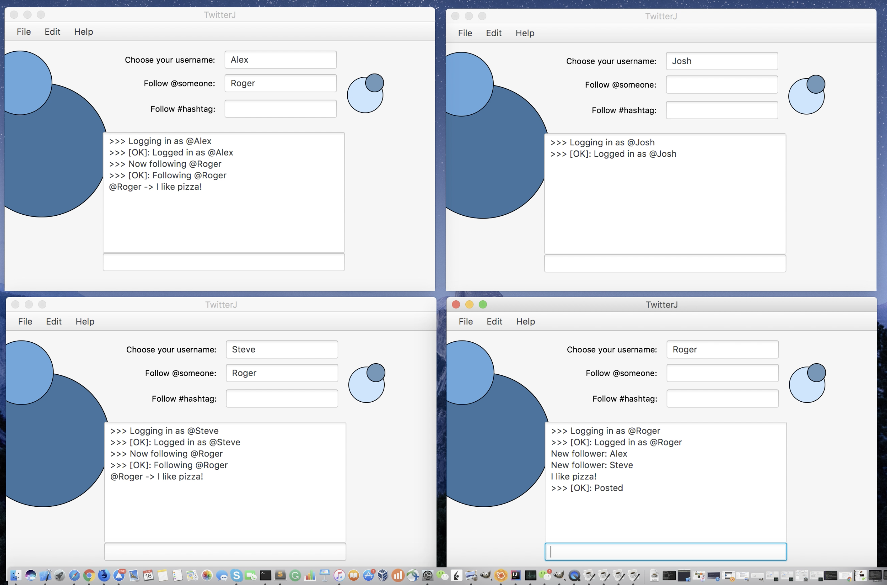
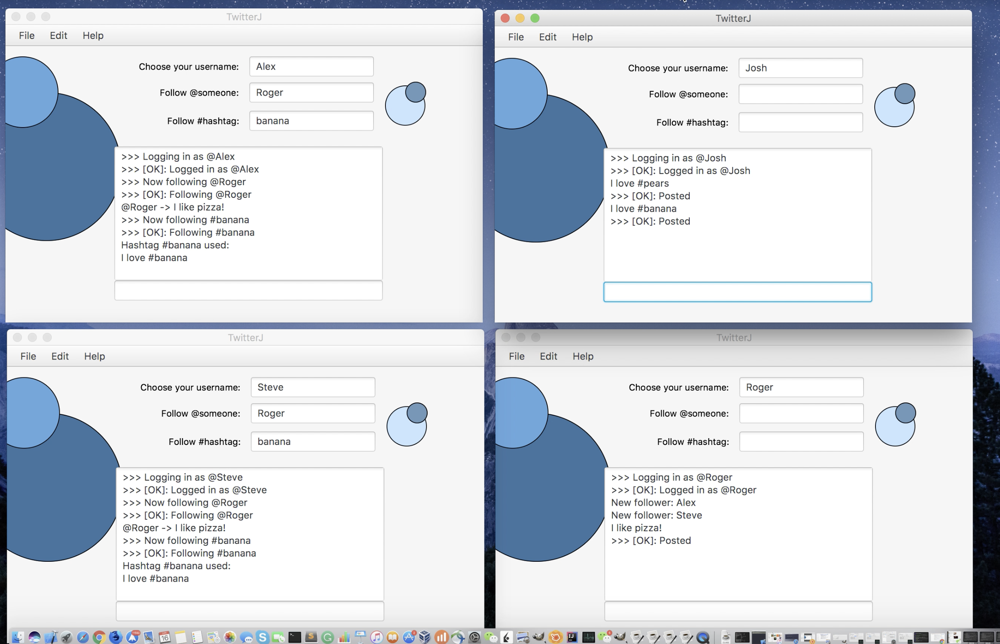
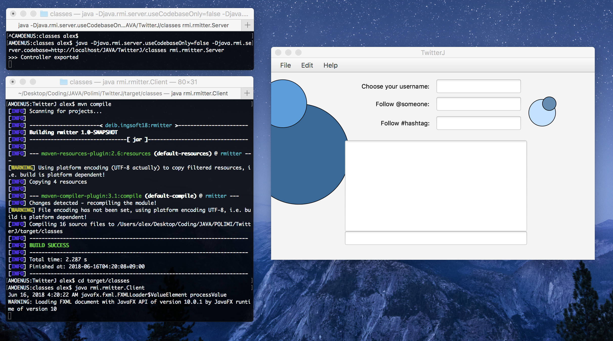

# TwitterJ
a Java distributed application resembling Twitter allowing multiple clients to interact at the same time.

<h2> Featuring: following </h2>
<p>A generic user A can follow a user B, user A will recieve on his feed all the tweets posted by the user B in real-time</p>



<h2> Featuring: hashtag </h2>
<p>A generic user A can follow an hashtag, user A will recieve on his feed all the tweets posted by the all the users mentioning the hashtag in real-time</p>


<h2> Technology </h2>
<ul>
<li>The technological stack used is based on a RMI distributed architecture, using the Java library java.rmi.
<li>The application is implemented thourgh a Model-View-Controller design pattern.
<li>Additional abstraction is added with the Observer-Observed design pattern.
<li>The GUI is implemented using the library JavaFX, using FXML files as source code. 
</ul>

<br>
<br>

### Build and Deployment
Requires JAVA and Maven, compile as follow
```bash
mvn compile
```
Open a bash terminal for the Server, and go inside target/classes
```bash
cd target/classes 
java rmi.rmitter.Server
```
Similar for the Client, open as many as you want
```bash
cd target/classes 
java rmi.rmitter.Client
```


<br>
<br>
<br>
<p>* the projects follow the guidelines of the "Software Engineering project" course at Politecnico di Milano, [https://github.com/affo/ingsoft-project]</p>


